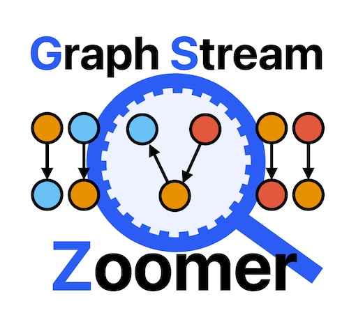

[](https://www.apache.org/licenses/LICENSE-2.0)
[](https://flink.apache.org)
# Graph Stream Zoomer



*Graph Stream Zoomer* is a open source (ALv2) distributed grouping algorithm for property graph streams based on 
[Apache Flink&reg;](https://flink.apache.org) and [Gradoop](https://github.com/dbs-leipzig/gradoop).

> This project currently under development.


## Features

With *Graph Stream Zoomer* you can summarize a stream of property graph elements (labeled, attributed 
vertices and edges) by selecting various grouping characteristics and 
aggregate functions and a window size. Through the closed operator concept, the result is again a property 
graph stream consisting of summarized vertices and edges. The system is based on Apache Flink&reg; and its 
Table API, SQL API and DataStream API, thus providing a distributed execution of the summarization.

## Usage

### As an own project
1. Clone this repo
2. Install as maven repository via `mvn install`
3. Create a new main function in package `edu.dbsleipzig.stream.grouping.application`
4. Use this template to create a simple grouping
````
// Init the Flink stream environment
StreamExecutionEnvironment env = StreamExecutionEnvironment.createLocalEnvironment();
// Load the stream using our data model
DataStream<StreamTriple> triples = ... // load data from stream source
// Create a stream graph
StreamGraph streamGraph = StreamGraph.fromFlinkStream(triples, new StreamGraphConfig(env));

// Create a grouping builder to define the grouping configuration
TableGroupingBase.GroupingBuilder groupingBuilder = new TableGroupingBase.GroupingBuilder();

// Group edges and vertices on 'label'-property and count the amount.
groupingBuilder.setWindowSize(10, WindowConfig.TimeUnit.SECONDS);
groupingBuilder.addVertexGroupingKey(":label");
groupingBuilder.addEdgeGroupingKey(":label");
groupingBuilder.addVertexAggregateFunction(new Count());
groupingBuilder.addEdgeAggregateFunction(new Count());

// Trigger the operator execution and print the result
streamGraph = groupingBuilder.build().execute(streamGraph);
streamGraph.print();

// Execute the flink workflow
env.execute();
````
### As part of your project
1. Clone this repo 
2. Install as maven repository via `mvn install`
3. Include dependency to your project pom.xml
```
<dependency>
  <groupId>edu.dbsleipzig</groupId>
  <artifactId>graph-stream-grouping</artifactId>
  <version>0.1-SNAPSHOT</version>
</dependency>
```

## Examples
* LocalExample -> loads a tiny stream from a collection
* TwitterExample -> loads a live twitter message stream (credentials required)
* CitiBikeExample -> uses citibike rental data to create a graph stream
* RandomGeneratorExample -> loads a random generated graph stream with configurable frequency

## Execution on Apache Flink Cluster

The power of the zoomer relies on the distributed processing coming with Apache Flink. To execute the 
zoomer on an Apache Flink cluster, you have to follow three easy steps:

1. set the Flink dependencies in the `pom.xml` to scope `provided` by changing the property from `<flink.scope>compile</flink.scope>` to `<flink.scope>provided</flink.scope>`
2. run `mvn clean package` to build the project and create the file `target/graph-stream-grouping-0.1-SNAPSHOT.jar`
3. on the running flink cluster, deploy your job (e.g. the `RandomGeneratorExample`) via 
`bin/flink run -c edu.dbsleipzig.stream.grouping.application.RandomGeneratorExample target/graph-stream-grouping-0.1-SNAPSHOT.jar 10 1000` (10s tumbling window with 1000 elements/sec random input)

## Details

### Windowing
*Graph Stream Zoomer* groups the graph using a windowing approach. The user can specify the size of the
window by a `WindowConfig`. Currently, there are just tumbling windows supported, but sliding windows are
planned for the near future.

Example window definition for a 10 seconds tumbling window:

`groupingBuilder.setWindowSize(10, WindowConfig.TimeUnit.SECONDS);`

### Grouping Keys
Vertices as well as edges will be grouped by common characteristics, which we call grouping keys. These
characteristics can be zero, one or multiple of the following:
* Label - groups all vertices/edges sharing the same type label
* Property value (by name) - groups all vertices/edges that contain a property with the specified name and
  an equal value. All vertices/edges _without_ a property of this name are grouped as one group. The super
  vertex or super edge (the resulting group representative) contains the property and (1) the respective
  value or (2) null, for the group that do not have this property
* Time - groups all vertices/edges with a timestamp in the same window -> see _Windowing_ above
* User-defined grouping key - tbd.

### Aggregate functions
Vertices and edges are grouped according to the selected grouping keys. The content of all vertices/edges
that are grouped together can be used to calculate aggregates that will be part of the super vertex /
super edge (the resulting group representative).
* Count - just counts the number of elements that were merged to a group and stores them in a new property
  with name `count`
* MinProperty - calculates the minimum value of a given property and stores it to a new property called
  `min_{name}`. Just works with numerical property values.
* MaxProperty - calculates the maximum value of a given property and stores it to a new property called
  `max_{name}`. Just works with numerical property values.
* AvgProperty - calculates the average value of a given property and stores it to a new property called
  `avg_{name}`. Just works with numerical property values.
* User-defined aggregate function - tbd.

## Graph Stream Data Model
The graph stream data model of *Graph Stream Zoomer* is defined as follows.

`DataStream<StreamTriple>` -> the Flink representation of a graph stream

`StreamTriple`
* `StreamVertex`
* `StreamEdge`
* `StreamVertex`

`StreamVertex`
* `id (String)`
* `label (String)`
* `properties (Properties)`
* `event_time (Timestamp)`

`StreamEdge`
* `id (String)`
* `label (String)`
* `properties (Properties)`
* `source_id (String)`
* `target_id (String)`
* `event_time (Timestamp)`

## Credits
This project has its base in two master thesis. It contains main ideas and code fragments from E. Saalmann 
and his master thesis titled "Relational abstraction of the EPGM by using the Table-API of apache Flink" 
([link](https://dbs.uni-leipzig.de/file/Masterarbeit_Saalmann.pdf)). It is further based on a second 
master thesis of R. Noureddin titled "Distributed Grouping of Property Graph Streams" 
([link](https://dbs.uni-leipzig.de/file/Master-Thesis-Rana-Noureddin.pdf)). The current implementation 
process is coordinated by [@ChrizZz110](https://github.com/ChrizZz110) and 
[@MaxZim21](https://github.com/MaxZim21).

### Disclaimer

Apache&reg;, Apache Flink, Flink&reg;, are either registered trademarks or trademarks of the Apache Software Foundation
in the United States and/or other countries.
